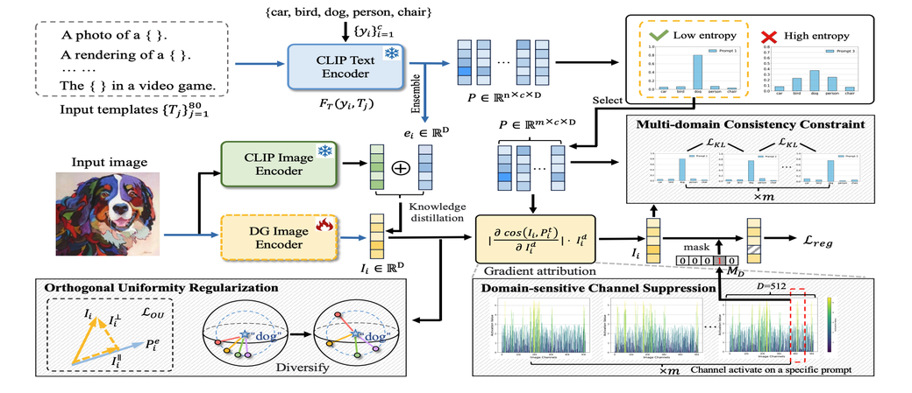
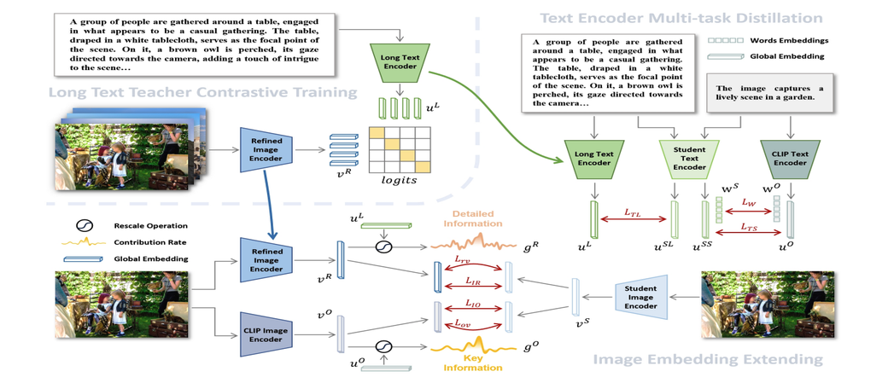
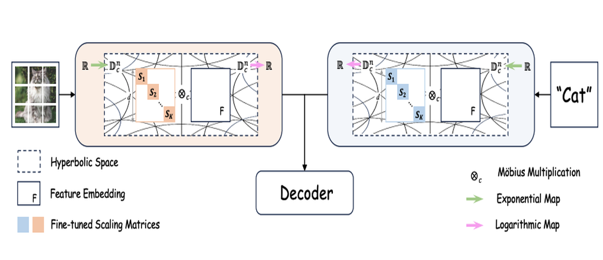
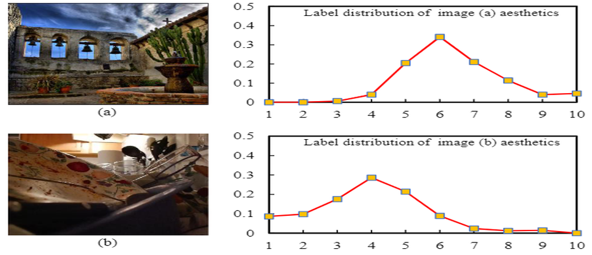








I’m a first-year PhD student from the School of Computer Science, Shanghai Jiaotong University. I received my Master's degree from Nankai University and my Bachelor's degree from Xidian University in 2017 and 2021, respectively. I am very fortunate to be advised by Prof. [**Wei Shen**](https://shenwei1231.github.io/).

My research interests lie in the fields of computer vision and deep learning, with a particular focus on image-text multi-modal learning, semantic segmentation, and label distribution learning. I am driven by the challenge of creating models that can understand and generate meaningful representations from complex, multi-modal scenes. Please feel free to contact me through email: changsong@sjtu.edu.cn.

# 📖 Educations
- *2024.09 - 2028.06 (now)*, PhD student of Shanghai Jiaotong University. 
- *2021.09 - 2024.06*, Master student of Nankai University. 
- *2017.09 - 2021.07*, Undergraduate student of Xidian University.

  # 🔥 News
- *2025.02*: &nbsp;🎉🎉 three paper are accapted by CVPR 2025.
- *2023.07*: &nbsp;🎉🎉 One paper is accapted by ICCV 2023. 
- *2023.03*: &nbsp;🎉🎉 One paper is accapted by CVPR 2023. 

  # 🎖 Honors and Awards
- *2023.10* National Scholarship.
- *2022.11* Gongneng Scholarship of Nankai University.
- *2021.11* Recommended Scholarship of Nankai University.
- *2021.07* Outstanding Graduates Awards. 
- *2020.10* Special Scholarship of Xidian University. 

# 📝 Publications 

  
 

    
CVPR 2025

    
  

  
[Domain Generalization in CLIP via Learning with Diverse Text Prompts]

**Changsong Wen**, Zelin Peng, Yu Huang, Xiaokang Yang, Wei Shen

  
 

    
CVPR 2025

    
  

  
[Retaining Knowledge and Enhancing Long-Text Representations in CLIP through Dual-Teacher Distillation]

Yuheng Feng, **Changsong Wen**, Zelin Peng, Li jiaye, Siyu Zhu

  
 

    
CVPR 2025

    
  

  
[Understanding Fine-tuning CLIP for Open-vocabulary Semantic Segmentation in Hyperbolic Space]

Zelin Peng, Zhengqin Xu, Zhilin Zeng, **Changsong Wen**, Yu Huang, Menglin Yang, Feilong Tang, Wei Shen

  
 

    
CVPR 2023

    
  

  
[DIP: Dual Incongruity Perceiving Network for Sarcasm Detection](https://openaccess.thecvf.com/content/CVPR2023/papers/Wen_DIP_Dual_Incongruity_Perceiving_Network_for_Sarcasm_Detection_CVPR_2023_paper.pdf)

**Changsong Wen**, Guoli Jia, Jufeng Yang 

ICCV 2023

[Ordinal Label Distribution Learning](https://openaccess.thecvf.com/content/ICCV2023/papers/Wen_Ordinal_Label_Distribution_Learning_ICCV_2023_paper.pdf)

**Changsong Wen**, Xin Zhang, Xingxu Yao, Jufeng Yang

